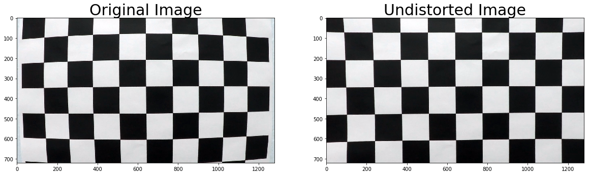
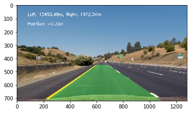

# CarND P4: Advanced Lane lines

The goal for this project is to create a pipeline for processing road images and
detect the lane on the road using computer vision methods. In the following sections, I explain the different steps taken to implement a successful detection pipeline.

The submission consists of the following files:
* writeup.md - you are reading it!
* AdvancedLaneLines.ipynb - contains the code used in the project
* output_images - folder containing sample output
* project_output.mp4 - processed project video using the pipeline

## Camera calibration
The first step before processing road images is to calibrate the camera using
checkboard images. We have to cycle through each of the calibration images, find
find the checkboard corners, and then use this values to obtain a distortion
coefficient and distortion matrix with cv2 calibrateCamera function. These values
can then be used to undistort an image using the undistort function.Here is an example of an undistorted image of the checkboard:

We can  use these values to undistort road images:

## Color and Gradient thresholds
Once we have undistorted images we can begin applying color and gradient
transformations to the road images and create a clear representation of the
lines on the road. These transformations can be combined to create a more robust
implementation and make sure that what we want to extract from the image, in this case the lines on the road, are highlighted and noise is at its minimum. The following images show thresholded images applying Sobel functions:

For the processing pipeline, I used S-channel combined with the X gradient from
a Sobel filter. Using this transformation, the lines appear clearly on the road
minimizing the effect of color changes and shadows. The result from this
operation is a binary image highlighting the lanes on the road.

## Perspective transform
After obtaining a binary image, we can apply a perspective transform to the image
to obtain a bird's eye view of the road. This is done by warping the image using
four points from a trapezoid shape that when transformed becomes a rectangle. As
an example, an image with a straight lane will appear as two vertical lines on the
warped image. The following points were used for applying the transform with an added offset in the X direction, source and destination respectively:

| X | Y |
|:---:|:---:|
| 594 | 450 |
| 190 | 720 |
| 1130 | 720 |
| 686 | 450 |

| X | Y |
|:---:|:---:|
| 190 | 0 |
| 190 | 720 |
| 1130 | 720 |
| 1130 | 0 |

Here is an example of a transformed image:

Applying the warp function to a thresholded image looks like this:

## Finding Lines
After applying perspective transform on the image, we can detect lines by using
an sliding window approach. The first step is to create a histogram of the values
of the image that can be used to obtain the position of the lines in the image.

We define a small window centered at the calculated position and we find the pixels
contained in that window. We obtain the mean value for those pixels and repeat the
process to the top of the image until we reach the defined number of windows along
the image. We can use the values obtained from this operation to fit the points
and obtain a best fit polynomial.

For following frames, we can use the polynomial values to find pixels within a
defined margin so that the blind search doesn't have to be repeated.

## Curvature and Position Calculation
After obtaining a fit to the left and right lines on the road, we can use these
values to calculate the curvature and position of the lane. We use the curvature formula using scaled values for the pixel line fit to match actual measurement in meters. The same scaling is applyied when calculating the position of the vehicle
by computing the center of the lane in relationship to the absolute center of the image assuming that the camera is right at the center of the car.

## Unwarp Detection
The last step is to unwarp the processed image to have the original perspective
and drawing the detected lane area with the computed curvature and position.

## Pipeline
The pipeline consists of the following steps:
* Undistort image
* Apply color and gradient test_thresholding
* Apply perspective transform to warp image to bird's eye view
* Detect the lines on the frames
* Compute curvature and position of the detected image
* Unwarp the image and superimpose on original frames

The output video of applying the pipeline to the project video is in
project_output.mp4.

## Challenges and Improvements
One of the major challenges is detecting lines when there are shadows and color
changes on the road. It is important to set the correct threshold values to obtain
an image that highlights the lines on the road. Threshold alone performed well
on the project video but a major improvement would be to implement a better
error checking algorithm to discard bad frames while maintaining an accurate
representation of the lane. Sum of squares error can be applied to discard bad frames and make the pipeline more robust. I will continue improving the pipeline
and test different methods.
